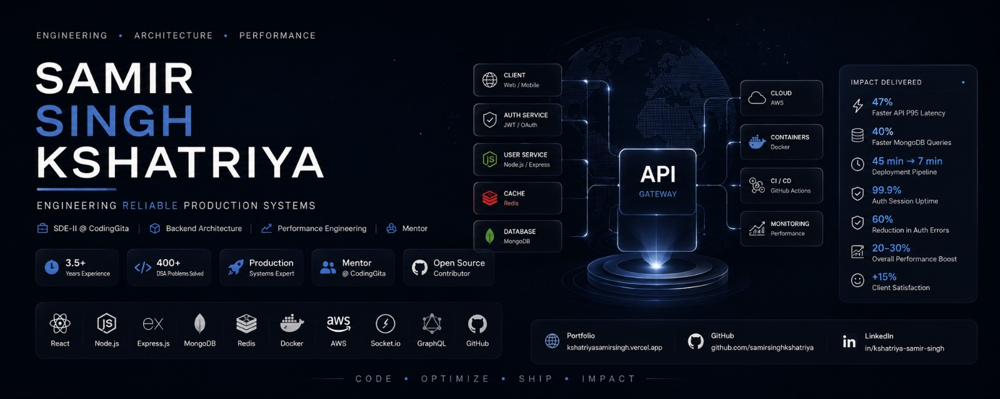

  

# Hi, I'm Samir Singh Kshatriya 👋

### SDE-II • Backend Architecture • Performance Engineering • Mentor @ CodingGita

Building scalable production systems with a focus on backend architecture, high-performance APIs, cloud infrastructure, and developer experience.

  

  

  

  

  

   <a href="#-about-me">About</a> ·
   <a href="#-engineering-impact">Impact</a> ·
  <a href="#-dsa--problem-solving">DSA</a> ·
  <a href="#-experience">Experience</a> ·
  <a href="#️-featured-projects">Projects</a> ·
  <a href="#-github-stats">Stats</a> ·
  <a href="#-lets-connect">Connect</a>

  

> *"Good code ships features. Great engineering ships reliability — measured, optimized, and built to scale."*

 

<!-- ============ ENGINEER CHARACTER SHEET ============ -->

<table>
<tr>
<td align="center" width="100%">

### 🎮 Engineer Character Sheet

</td>
</tr>
<tr>
<td>

| | |
|---|---|
| 🧝 **Class** | SDE-II · Full-Stack MERN Engineer |
| 🏰 **Guild** | Coding Gita, Kalol, Gandhinagar |
| 🧙 **Guild Role** | Mentor — guiding engineers on architecture & code quality |
| ⏳ **Years Active** | 3.5+ (2023 – Present) |
| 🎯 **Specialization** | Backend Architecture · API Design · Performance Tuning |
| 🗡️ **Signature Move** | Cut API P95 latency by 47% with caching + query optimization |
| 🛡️ **Passive Skill** | 99.9% auth-session uptime under production load |
| 📜 **Side Quest** | Daily DSA grinding on LeetCode — arrays to graphs to DP |
| 🚀 **Current Buff** | Open to full-stack / backend opportunities |

</td>
</tr>
</table>

---

## 👨‍💻 About Me

🚀 &nbsp;**SDE-II** @ **Coding Gita**, Gandhinagar — building end-to-end production web applications

🧑‍🏫 &nbsp;**Mentor at Coding Gita** — guiding engineers on architecture, code quality, and production best practices

📆 &nbsp;**3.5+ years** of continuous full-stack engineering experience across three companies (2023 – Present)

⚡ &nbsp;Specialize in **backend architecture, MongoDB performance tuning, REST/GraphQL API design, and cloud CI/CD**

🧠 &nbsp;Sharpen problem-solving daily with **Data Structures & Algorithms on LeetCode** — arrays, trees, graphs, DP, and more

🏗️ &nbsp;Shipped **StackIt** (AI-assisted community Q&A platform) and **GameZone** (real-time multiplayer gaming platform)

☁️ &nbsp;Comfortable across **Docker, AWS ECS, GitHub Actions, Redis caching, JWT/OAuth, and Socket.io**

🎓 &nbsp;B.E. Computer Engineering, Gujarat Technological University — **CGPA 9.4**

🌐 &nbsp;Portfolio → **[kshatriyasamirsingh.vercel.app](https://samirsir-portfolio.vercel.app/)**

📫 &nbsp;GMail → **[samirsinghkshatriya@gmail.com](mailto:samirsinghkshatriya@gmail.com)**

 

---

## 📈 Engineering Impact

| Area | Result |
|---|---:|
| ⚡ API P95 Response Time | **47% Faster** |
| 🗄️ MongoDB Query Execution | **Up to 40% Faster** |
| 🚀 Deployment Pipeline | **45 min → 7 min** |
| 🟢 Auth Session Reliability | **99.9% Uptime** |
| 🔐 Auth-Related Errors | **60% Reduction** |
| 📊 Application Performance | **20–30% Improvement** |
| 🖥️ Page Load Speed | **30% Faster** |
| 🤝 Client Satisfaction | **+15%** |

---

## 🧩 DSA & Problem Solving

  

  

---

## 💼 Experience

<table>
<tr>
<td width="140" valign="top"><b>07/2025 – Present</b></td>
<td>
<b>SDE-II & Mentor</b> · Coding Gita — <i>Gandhinagar, Gujarat</i> 
Builds and maintains end-to-end MERN applications; optimized MongoDB schemas, indexes, and aggregation pipelines, cutting query execution time by up to 40%. Mentors engineers on architecture and code quality, and leads Agile/Scrum sprints with regular code reviews.
</td>
</tr>
<tr>
<td valign="top"><b>04/2024 – 06/2025</b></td>
<td>
<b>SDE-I</b> · Arsh tech pvt LTD — <i>Remote, Gujarat</i> 
Shipped a multi-tenant MERN application; improved P95 response time by 47% via Node/Express optimization, Redis caching, and indexed MongoDB queries. Designed REST/GraphQL APIs with JWT/OAuth, cutting auth errors 60%. Built CI/CD with Docker, GitHub Actions, and AWS ECS — deploy time down from 45 min to 7 min.
</td>
</tr>
<tr>
<td valign="top"><b>01/2023 – 03/2024</b></td>
<td>
<b>Web Developer</b> · IT Path Solutions — <i>Ahmedabad, Gujarat</i> 
Engineered responsive front-end solutions with HTML5, CSS3/SASS, and JavaScript — boosting page speed 30%, cutting load time 25%, and lifting client satisfaction by 15%.
</td>
</tr>
</table>

---

## 🧠 Engineering Principles

| Principle | In Practice |
|---|---|
| 📏 Measure before optimizing | Profiled P95 latency before touching Node/Express internals — turned into a 47% real gain |
| 🔍 Query plans over guesswork | Indexed and restructured MongoDB aggregations instead of throwing hardware at slow queries |
| 🔁 Automate the boring parts | Replaced manual deploys with Docker + GitHub Actions + AWS ECS — 45 min cut to 7 |
| 🛡️ Auth is not an afterthought | JWT/OAuth redesign cut auth-related errors by 60% |
| 🧩 Practice fundamentals daily | Regular DSA practice keeps problem-solving sharp for interviews and real system design |

---

## 🏗️ Featured Projects

<table>
<tr>
<td width="50%" valign="top">

### 🤖 StackIt
**Community Q&A Platform (MERN + AI)**

- Authentication, rich-text Q&A, and voting system
- AI-powered assistant for tag suggestions & question similarity
- Admin dashboard with moderation & usage-stats export

🔗 [Live](https://stackit-odoo.netlify.app/)

</td>
<td width="50%" valign="top">

### 🎮 GameZone
**Real-Time Multiplayer Gaming Platform**

- Racing, Puzzle, Action & Strategy game modes
- Real-time multiplayer with live leaderboards
- Cross-platform support (Web + Mobile)

🔗 [Live](https://gamezoneofficial.netlify.app/)

</td>
</tr>
</table>

---

## 🛠️ Tech Stack

 
<b>🌐 Frontend</b>

  

 
<b>⚙️ Backend</b>

  

 
<b>🗄️ Database & Caching</b>

  

 
<b>☁️ Cloud & DevOps</b>

  

 
<b>💻 Core Programming & DSA</b>

---

## 🎓 Education

🎓 **B.E., Computer Engineering** — Gujarat Technological University (2019 – 2023)
**CGPA: 9.4**

---

## 🤝 Let's Connect

&nbsp;

&nbsp;

&nbsp;

&nbsp;

---

## 📊 GitHub Stats

 

  

  

### 🐍 Contribution Snake

  

